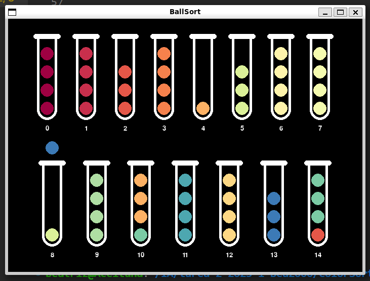
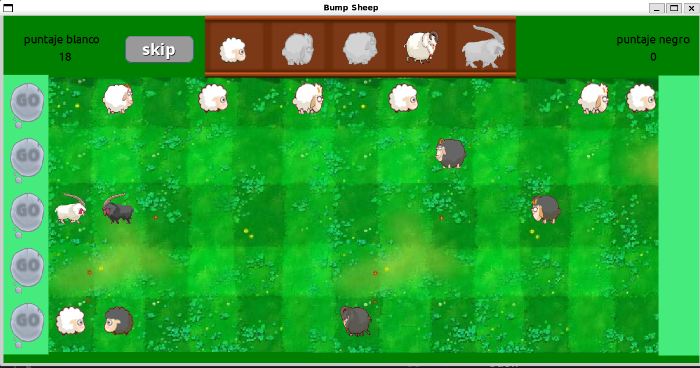

# AI Assignment - Color Sort and Bump Sheep

This repository contains the implementation of two AI-based problem-solving tasks: **Color Sort** and **Bump Sheep**, completed as part of my *Artificial Intelligence* course during the first semester of 2023 at the Pontificia Universidad Católica de Chile.

## Project Overview

### 1. Color Sort

Color Sort is a puzzle game where the objective is to sort colored balls into tubes such that each tube contains balls of only one color. This task is modeled as a search problem and solved using the **A*** search algorithm.



#### Files for Color Sort

- **`binary_heap.py` and `node.py`**: Implementations of data structures required for A*.
- **`BallSortBack.py`**: Manages the game's logic.
- **`BallSortFront.py`**: Handles the game's visualizations.
- **`puzzle_generator.py`**: Generates initial configurations of balls and tubes for testing.
- **`heuristics.py`**: Contains heuristic functions for solving the puzzle.
- **`maps/`**: Stores puzzle configurations generated by the `puzzle_generator.py`.
- **`BallSortSolver.py`**: Contains the A* implementation for solving the Color Sort puzzle.

### Tasks

1. **Integrate A* Search**: Implement the A* search method in `BallSortSolver.py`.
2. **Lazy A***: Implement a variant of A* that allows multiple instances of the same state in the priority queue.
3. **Heuristic Implementation**: Implement and compare different heuristics in `heuristics.py`:
   - **Wagdy heuristic**: Estimates the number of consecutive differently colored balls.
   - **Repeated Color heuristic**: Evaluates how far each ball is from the most frequent color in each tube.
4. **Heuristic Admissibility**: Analyze the admissibility and effectiveness of the heuristics.
5. **Comparison of Heuristics**: Empirical comparison of heuristics based on execution time and memory usage.
6. **Greedy Best-First Search**: Implementation and comparison with A*.

### 2. Bump Sheep

Bump Sheep is a competitive game where two players take turns placing sheep on a board. Each player must strategically push the opponent's sheep off the board to score points. This game involves search algorithms to optimize the placement and movement of sheep.



#### Files for Bump Sheep:

- **`main.py`**: Main file that runs the game using the `pygame` library.
- **Various other files**: Support the game's functionality (board setup, player moves, etc.), but only specific highlighted files need to be modified for algorithm development.

### Tasks

1. **Understand the Rules**: Get familiar with the game's rules by playing against the AI.
2. **Implement Greedy Best-First Search**: Modify the search algorithm to prioritize the best immediate moves.
3. **Analyze Performance**: Compare Greedy Best-First Search and A* in terms of memory usage and execution time.

## How to Run the Projects

### Color Sort

1. Clone the repository:

   ```bash
   git clone https://github.com/your-username/repo.git
   cd repo/ColorSort
   ```

2. Generate a puzzle:

   ```bash
   python puzzle_generator.py
    ```

3. Run the solver:

   ```bash
   python BallSortSolver.py
   ```

### Bump Sheep

1. Navigate to the `BumpSheep` directory:

   ```bash
   cd repo/BumpSheep
    ```

2. Run the game:

   ```bash
   python main.py
   ```

## Acknowledgments

This project was completed as part of the Artificial Intelligence course during the first semester of 2023 at the Pontificia Universidad Católica de Chile.
